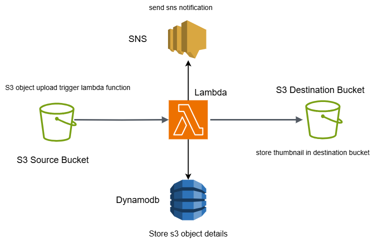

# s3-upload-compliance

## Requirements
1. Object uploaded to s3 bucket -> trigger upload event -> 
   aws lambda process event -> details of object save into dynamodb table.
   e.g (file type, file size, file name, datetime).
2. When s3 object size greater than 250Mb -> trigger SNS notification to account user.
3. When s3 object type is jpg/png/jpeg create a thumbnail in another bucket.
4. Implement lifecycle policies on bucket object. Move source bucket obejct
   afetr 30days and 60 days to IA and Deep archive, delete after 90 days.
---

## Design
- Create two s3 bucket source and dest bucket.
- Create lambada function using sam and deploy to aws.
- Cloudformation template in sam app that create dynamodb, 
  lambda execution role and sns topic and subscription.
- Configure s3 object create trigger action in terraform.
---

## Tools
1. AWS Cloud
2. SAM & SAM Cli
3. Terraform
4. Git
5. Python
6. AWS SDK (boto3)
---

## AWS services used
1. S3
2. Lambda Functions
3. SNS
4. Dynamodb
5. IAM
6. CloudFormation
---

### Architecture


---

## Installation

### 1. Clone repo
```bash
git clone https://github.com/Jayharer/s3-upload-compliance.git
```

### 2. Install aws cli & configure default profile

### 3. Install sam cli

### 4. Create s3 bucket in aws
```bash 
aws s3 md s3://your-s3-bucket-name
```

Update **src/samconfig.toml** with
```
s3_bucket = "your-s3-bucket-name"
```

Update **iac/backend.tf** with
```
bucket = "your-s3-bucket-name"
```

## 4. Deploy lambda functions
```bash
cd src
sam build
sam deploy
```

## 4. Terraform IAC
```bash
cd iac 
terraform init
terraform plan 
terraform apply
```
---

## Clean up
Delete all resources from AWS cloud
```bash
aws cloudformation delete-stack --stack-name sam-app-s3-upload
cd iac 
terraform destroy
```
